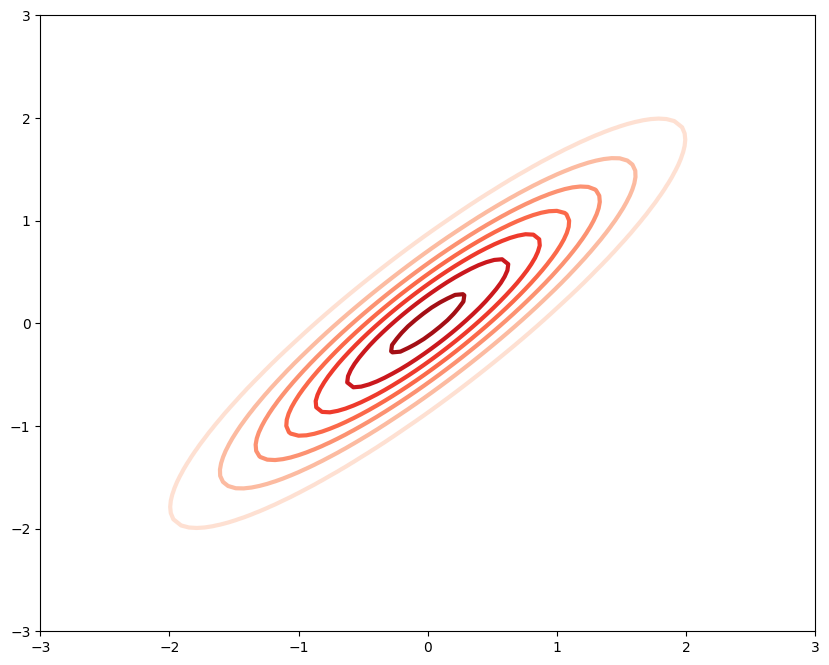

# Predicting Heating Load with Hamiltonian Monte Carlo Sampling and Bayesian Linear Regression

<strong>Adam El Kholy</strong> \
<strong>University of Bath</strong> \
Last Updated: <strong>03/05/2024</strong>

Free to use under the Apache 2.0 license 

The following notebook demonstrates the implementation of a HMC sampler with Bayesian Linear Regression, for use on the provided heating load dataset. While the implementation of models is fully functional, the final prediction of heating load results in an RMSE which could certainly be improved upon. This is due to the non-linear nature of the dataset itself requiring a non-linear model for accurate predictions accordingly. This project scored a finak grade of 86% on the University of Bath Bayesian Machine Learning course 2024. For the corresponding report and analysis of findings, see BayesianML.pdf.


```python
import pandas as pd
import numpy as np
import matplotlib.pyplot as plt
import hmc_Lab as hmc
from scipy import stats
```

# Exploratory Data Analysis


```python
def load_data(path):
    data = np.genfromtxt(path, dtype=float, delimiter=',', skip_header=True)
    X = data[:, :-1]
    y = data[:, -1]

    # zero mean norm = (x - mu) / var
    means = [np.mean(X[:, i]) for i in range(X.shape[1])]
    vars  = [np.var(X[:, i]) for i in range(X.shape[1])]
    X = np.array([(x - means)/vars for x in X ])

    # preserve constant bias term
    X[:, 0] = 1 

    return X, y

X_train, y_train = load_data("data/ee-train.csv")
X_test, y_test = load_data("data/ee-test.csv")
```


```python
fig, ax = plt.subplots()
ax.scatter([x for x in range(384)], y_train)
ax.set_ylabel('heating load')
ax.set_xlabel('$x = [c, x_1, ... x_8]$')
ax.set_title("Heating load dataset")
plt.show()
```


    

    


```python
data = np.genfromtxt("data/ee-train.csv", delimiter=',', names=True)
headers = data.dtype.names

fig, ax = plt.subplots(3, 3, figsize=(12, 9))

for i in range(3):
    for j in range(3):
        k = i*3 + j
        ax[i, j].scatter([x[k] for x in X_train], y_train)
        ax[i, j].set_title(f'{headers[k]} against heading load')  
        ax[i, j].set_xlabel(headers[k])  
        ax[i, j].set_ylabel('heating load')  

plt.tight_layout()
plt.show()
```


    

    


# Linear List Squares


```python
# simple functions for performance metrics and predictions
def get_predictions(coefficients, X):
    return np.array([sum(coefficients* x) for x in X])

def calculate_MAE(predictions, y):
    return np.mean(np.abs(y - predictions))

def calculate_MAPE(predictions, y):
    return np.mean(np.abs(y - predictions) / y)

def calculate_RMSE(predictions, y):
    return np.sqrt(np.mean((y - predictions)**2))
```


```python
# fit linear least squares
coefficients = np.linalg.lstsq(X_train, y_train, rcond=None)[0]
print("Coefficients:", coefficients)

# calculate errors
train_predictions = get_predictions(coefficients, X_train)
test_predictions = get_predictions(coefficients, X_test)
train_MAE = calculate_MAE(train_predictions, y_train)
test_MAE = calculate_MAE(test_predictions, y_test)
train_MAPE = calculate_MAPE(train_predictions, y_train)
test_MAPE = calculate_MAPE(test_predictions, y_test)
train_RMSE = calculate_RMSE(train_predictions, y_train)
test_RMSE = calculate_RMSE(test_predictions, y_test)
```

    Coefficients: [ 2.29207031e+01 -7.69864896e-01 -1.52943185e+02 -1.26871001e+01
     -2.90059263e+02  1.25733555e+01 -1.37218620e-01  3.68805372e-01
      3.19452678e-01]
    


```python
# print predictions and true values
print("Prediction  :  True value")
for i in range(9):
    print(round(train_predictions[i], 2), "      : ", y_train[i], )

print("Train MAE:", train_MAE)
print("Test MAE:", test_MAE)
print("Train MAPE:", train_MAPE)
print("Test MAPE:", test_MAPE)
print("Train RMSE:", train_RMSE)
print("Test RMSE:", test_RMSE)
```

    Prediction  :  True value
    13.03       :  12.74
    27.39       :  29.68
    33.63       :  36.57
    32.94       :  38.57
    33.91       :  34.72
    15.43       :  16.99
    12.19       :  15.19
    28.11       :  28.56
    15.37       :  14.51
    Train MAE: 2.1306794414069454
    Test MAE: 2.3881568154446815
    Train MAPE: 0.09706328442508667
    Test MAPE: 0.1246507370597052
    Train RMSE: 3.0115517876503617
    Test RMSE: 3.1216830221083667
    

# Type-2 Maximum Likelihood

Precisions are defined as: $\alpha = 1 / \sigma_w^2$ and $ \beta = 1 / \sigma_{\epsilon}^2 $   
Priors of $\alpha$ and $\beta$ are assumed to follow flat Uniform distributions,


```python
# moodle
def compute_log_marginal(X, y, alph, beta):
    s2 = 1/beta
    N, M = X.shape
    C = s2 * np.eye(N) + ((X @ X.T) / alph)
    logML = -N/2 * np.log(2*np.pi)
    _, log_det = np.linalg.slogdet(C)
    logML -= log_det / 2
    logML -= y.T @ np.linalg.inv(C) @ y / 2
    return logML
```


```python
log_alphas = np.linspace(-5, 0, 100)
log_betas = np.linspace(-5, 0, 100)

alphas = np.exp(log_alphas)
betas = np.exp(log_betas)

log_prob_y = np.array([[compute_log_marginal(X_train, y_train, alpha, beta) for alpha in alphas] for beta in betas])
```


```python
max_b_index, max_a_index = np.unravel_index(np.argmax(log_prob_y, axis=None), log_prob_y.shape)
max_alpha = alphas[max_a_index]
max_beta = betas[max_b_index]
max_log_likelihood = log_prob_y[max_b_index, max_a_index]

print("Max alpha:", max_alpha)
print("Max beta:", max_beta)
print("Max log likelihood:", max_log_likelihood)
```

    Max alpha: 0.006737946999085467
    Max beta: 0.10303080346176416
    Max log likelihood: -1014.3788832248534
    


```python
fig, ax = plt.subplots()
CS = ax.contourf(log_alphas, log_betas, log_prob_y)
ax.scatter(log_alphas[max_a_index], log_betas[max_b_index], color="red", label="max point")

ax.set_title('log p(y | $\\alpha, \\beta$)')
ax.set_xlabel('log $\\alpha$')
ax.set_ylabel('log $\\beta$')
colorbar = fig.colorbar(CS, ax=ax)
ax.legend()
```


    <matplotlib.legend.Legend at 0x13bba2ace20>


    

    


```python
# compute posterior mean and covariance
def compute_posterior(X, y, alph, beta):
    s2 = 1/beta
    x1 = np.dot(X.T, X) + (np.dot(np.dot(s2, alph), np.identity(X.shape[1])))
    Mu = np.dot(np.linalg.inv(x1), X.T.dot(y))

    # SIGMA calculation
    SIGMA = np.dot(s2, np.linalg.inv(x1))

    return Mu, SIGMA
```


```python
Mu, SIGMA = compute_posterior(X_train, y_train, max_alpha, max_beta)

train_predictions = X_train @ Mu
test_predictions = X_test @ Mu

train_RMSE = calculate_RMSE(train_predictions, y_train)
test_RMSE = calculate_RMSE(test_predictions, y_test)
train_MAE = calculate_MAE(train_predictions, y_train)
test_MAE = calculate_MAE(test_predictions, y_test)
train_MAPE = calculate_MAPE(train_predictions, y_train)
test_MAPE = calculate_MAPE(test_predictions, y_test)
```


```python
print("Train MAE:", train_MAE)
print("Test MAE:", test_MAE)
print("Train MAPE:", train_MAPE)
print("Test MAPE:", test_MAPE)
print("Train RMSE:", train_RMSE)
print("Test RMSE:", test_RMSE)
```

    Train MAE: 2.270080381184555
    Test MAE: 2.329704530496533
    Train MAPE: 0.10344028507621073
    Test MAPE: 0.12242949331800501
    Train RMSE: 3.0853142507266904
    Test RMSE: 3.13984067642743
    

# Verifying HMC on a standard 2D Gaussian


```python
def energy_func(x, covar):
    # mean is zero as per graph
    mu = np.zeros(np.shape(x)[0])
    neglgp = -stats.multivariate_normal.logpdf(x.T, mu, covar)
    return neglgp


def energy_grad(x, covar):
    # inverse covarance matrix
    cov_in = np.linalg.inv(covar)
    g = ((x.T @ cov_in.T) + (x.T @ cov_in))/2
    return g
```

We first visualise the distribution as follows


```python
covar = np.array([[1,0.9],[0.9,1]]) 

f = 5 
fsz = (10,8)
gsz = 100
lim = 3

# setup the mesh grid
gx = np.linspace(-lim, lim, gsz)
GX, GY = np.meshgrid(gx, gx)
Gsz = GX.size
G = np.hstack((GX.reshape((Gsz, 1)), GY.reshape((Gsz, 1))))

# plot the figure
plt.figure(figsize=fsz)
P = np.asarray([np.exp(-energy_func(g, covar)) for g in G])
plt.contour(GX, GY, P.reshape((gsz, gsz)), cmap='Reds', linewidths=3, zorder=1);
```


    

    


```python
# initialise the state for the first time step
x0 = np.random.normal(size=2)

# call the function from the pre-defined hmc module
hmc.gradient_check(x0, energy_func, energy_grad, covar)
```

    Calc.         Numeric       Delta         Acc.
          11.447        11.447  -6.446399e-11  12
         -10.914       -10.914  -3.514344e-10  11
    

Next we tune the hyperparameters and verify the sampler


```python
np.random.seed(seed=1)  

R = 5000
L = 20 
eps = 0.5
burn = int(R/10)

# HMC sampling
S, *_ = hmc.sample(x0, energy_func, energy_grad, R, L, eps, burn=burn, checkgrad=True, args=[covar])

# plot the figure
plt.figure(figsize=fsz)
plt.contour(GX, GY, P.reshape((gsz, gsz)), cmap='Reds', linewidths=3, zorder=1)
plt.plot(S[:, 0], S[:, 1], '.', ms=6, color='CadetBlue', alpha=0.25, zorder=0)
```

    Calc.         Numeric       Delta         Acc.
          11.447        11.447  -6.446399e-11  12
         -10.914       -10.914  -3.514344e-10  11
    |----------|  0% accepted [ 16 secs to go ]
    |#---------| 79% accepted [ 12 secs to go ]
    |##--------| 77% accepted [ 10 secs to go ]
    |###-------| 77% accepted [ 8 secs to go ]
    |####------| 77% accepted [ 7 secs to go ]
    |#####-----| 77% accepted [ 6 secs to go ]
    |######----| 77% accepted [ 5 secs to go ]
    |#######---| 77% accepted [ 4 secs to go ]
    |########--| 77% accepted [ 2 secs to go ]
    |#########-| 77% accepted [ 1 secs to go ]
    |##########| 77% accepted [ 0 secs to go ]
    HMC: R=5000 / L=20 / eps=0.5 / Accept=77.2%
    


    [<matplotlib.lines.Line2D at 0x1c5c85a1d90>]


    

    


# HMC with Linear Regression 


```python
def energy_func_lr(hps, x, y):
    log_alpha = hps[0]
    log_beta = hps[1]
    w = hps[2:]

    alpha = np.exp(log_alpha)
    beta = np.exp(log_beta)

    s2 = 1/beta
    N, M = x.shape

    # energy func = negative log likelihood + negative log prior
    neglog_likelihood = (0.5*N * np.log(2*np.pi*s2)) + (1 / (s2 * 2)) * np.sum( (y - x@w)**2)
    neglog_prior = - np.sum( 0.5 * np.log(alpha / (2*np.pi)) + (-0.5*alpha*w**2) )

    g = neglog_likelihood + neglog_prior

    return g
 

def energy_grad_lr(hps, x, y):
    log_alpha = hps[0]
    log_beta = hps[1]
    w = hps[2:]

    alpha = np.exp(log_alpha)
    beta = np.exp(log_beta)

    s2 = 1/beta
    N, M = x.shape
    
    # gradient for energy function 
    neglog_likelihood_gradient = (1/s2) * ((-x.T) @ (y - x@w))
    neglog_prior_gradient = alpha * w

    g = neglog_likelihood_gradient + neglog_prior_gradient

    # gradient wrt hyperparameters
    alpha_grad = -np.sum(0.5 / alpha - 0.5 * w**2) * alpha
    beta_grad = ((0.5 * N) / s2) + (-1/2) * (s2**-2) * np.sum((y - x@w)**2) 
    beta_grad = beta_grad * -s2

    g = np.concatenate(([alpha_grad, beta_grad], g))

    return g
```


```python
np.random.seed(seed=1) 

R = 1000
L = 20 
eps = 0.0045
burn = int(R/10)

x0 = np.random.normal(size=11)

S, *_ = hmc.sample(x0, energy_func_lr, energy_grad_lr, R, L, eps, burn=burn, checkgrad=True, args=[X_train, y_train])
```

    
    Calc.         Numeric     Delta            Acc.
    29.5076       29.5076     -7.866684e-07      8
    94213.3       94213.3     -2.100292e-06     11
    -4886.63      -4886.63    -8.113351e-06      9
    -32642.7      -32642.7    3.765224e-06      10
    44.674        44.674      -3.153689e-07      9
    -23.06        -23.06      3.901517e-06       7
    91.7814       91.7814     1.017210e-06       8
    -2113.3       -2113.3     -1.076671e-05      9
    -49.6927      -49.6927    7.549343e-06       7
    -6738.53      -6738.53    -6.445938e-06     10
    -27.1075      -27.1076    -8.339655e-06      7
    
    |----------|  0% accepted [ 5 secs to go ]
    |#---------| 100% accepted [ 4 secs to go ]
    |##--------| 100% accepted [ 3 secs to go ]
    |###-------| 100% accepted [ 3 secs to go ]
    |####------| 100% accepted [ 2 secs to go ]
    |#####-----| 100% accepted [ 2 secs to go ]
    |######----| 99% accepted [ 1 secs to go ]
    |#######---| 100% accepted [ 1 secs to go ]
    |########--| 100% accepted [ 1 secs to go ]
    |#########-| 100% accepted [ 0 secs to go ]
    |##########| 99% accepted [ 0 secs to go ]
    HMC: R=1000 / L=20 / eps=0.0045 / Accept=99.4%
    


```python
# hyperparam tuning 
eps= 0.014
R= 10000
L= 20
burn = int(R/10)

# using max hyperparams and previous weights as starting points
x0 = np.array([0.00155754180799815, 0.10303080346176416, 2.29207031e+01 ,7.69864896e-01 ,
              -1.52943185e+02 ,-1.26871001e+01,-2.90059263e+02 , 1.25733555e+01 ,
              -1.37218620e-01 , 3.68805372e-01, 3.19452678e-01])

# run sampler
S, *_ = hmc.sample(x0, energy_func_lr, energy_grad_lr, R, L, eps, burn=burn, checkgrad=False, args=[X_train, y_train])

# average optimal parameters
optimal_params = [np.mean(S[:, x]) for x in range(S.shape[1])]
print(optimal_params) 

# extract weights
optimal_weights = optimal_params[2:]

# get predictions and rmse
predictions = [x @ optimal_weights for x in X_test]
xs = [x for x in range(X_train.shape[0])]
rmse = np.sqrt(np.mean((y_test - np.array(predictions))**2))
print(rmse)

# plot predictions against ground truth
plt.scatter(xs, y_test, label="ground truth")
plt.scatter(xs, predictions, label="predictions")
plt.xlabel('$x = [c, x_1, ... x_8]$')
plt.ylabel("heating load")
plt.legend()
plt.show()
```

    |----------|  0% accepted [ 21 secs to go ]
    |#---------| 94% accepted [ 18 secs to go ]
    |##--------| 95% accepted [ 16 secs to go ]
    |###-------| 95% accepted [ 15 secs to go ]
    |####------| 95% accepted [ 13 secs to go ]
    |#####-----| 95% accepted [ 11 secs to go ]
    |######----| 95% accepted [ 8 secs to go ]
    |#######---| 95% accepted [ 6 secs to go ]
    |########--| 95% accepted [ 4 secs to go ]
    |#########-| 95% accepted [ 2 secs to go ]
    |##########| 95% accepted [ 0 secs to go ]
    HMC: R=10000 / L=20 / eps=0.014 / Accept=94.8%
    [-9.694004386315664, -2.22523522062341, 22.921442221601687, -0.8411908621976004, -171.02450704194484, -24.812910122815605, -312.2043868001974, 12.517084738329297, -0.13135510402158124, 0.3680597741878445, 0.32502395397473216]
    3.124915729626721
    


    

    


```python
train_predictions = np.array([x @ optimal_weights for x in X_test])
test_predictions = np.array([x @ optimal_weights for x in X_test])
train_RMSE = calculate_RMSE(train_predictions, y_train)
test_RMSE = calculate_RMSE(test_predictions, y_test)
train_MAE = calculate_MAE(train_predictions, y_train)
test_MAE = calculate_MAE(test_predictions, y_test)
train_MAPE = calculate_MAPE(train_predictions, y_train)
test_MAPE = calculate_MAPE(test_predictions, y_test)
```


```python
print("Train MAE:", train_MAE)
print("Test MAE:", test_MAE)
print("Train MAPE:", train_MAPE)
print("Test MAPE:", test_MAPE)
print("Train RMSE:", train_RMSE)
print("Test RMSE:", test_RMSE)
```

    Train MAE: 11.6506984277059
    Test MAE: 2.3985163887868635
    Train MAPE: 0.6273982869206876
    Test MAPE: 0.12517414523498172
    Train RMSE: 14.194014762775312
    Test RMSE: 3.124915729626721
    
